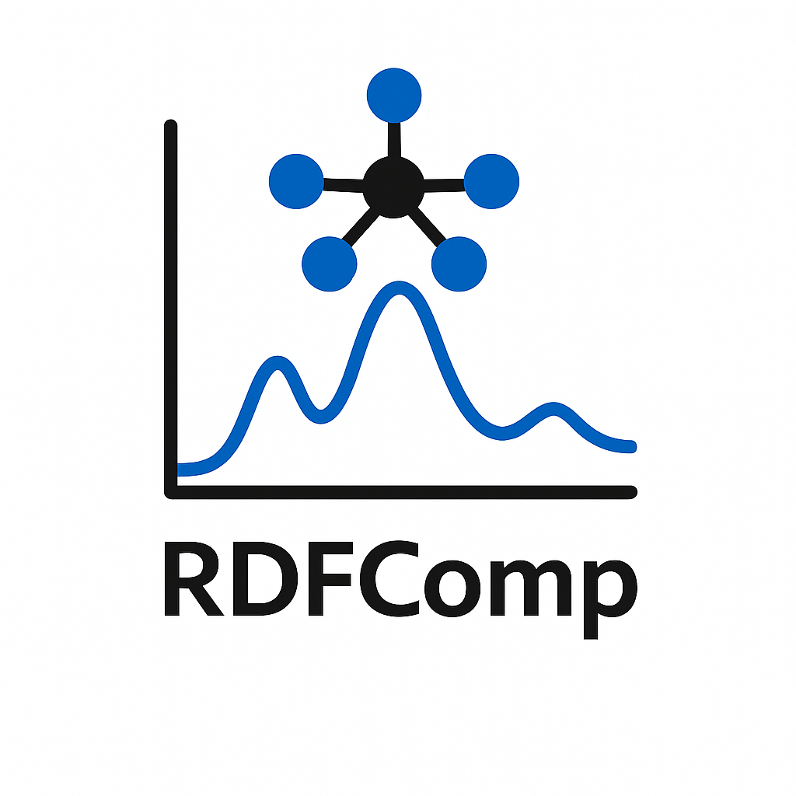

<div align="center">
  
</div>

A command-line tool for computing radial distribution functions (RDFs) from molecular dynamics trajectories in XYZ format, powered by [OVITO](https://www.ovito.org/).

---

📄 Author: **Ouail Zakary**
- 📧 Email: [Ouail.Zakary@oulu.fi](mailto:Ouail.Zakary@oulu.fi)
- 🔗 ORCID: [0000-0002-7793-3306](https://orcid.org/0000-0002-7793-3306)
- 🌐 Website: [Personal Webpage](https://cc.oulu.fi/~nmrwww/members/Ouail_Zakary.html)
- 📁 Portfolio: [GitHub Portfolio](https://ozakary.github.io/)

---

Two computation modes are available. In **per-atom mode** (default), each source atom produces its own independent g(r) curve — useful for trace species such as a few Xe atoms in a solvent. In **bulk mode** (`--bulk`), all source atoms are used simultaneously to produce a single population-averaged g(r) — the correct choice for bulk same-element RDFs (e.g. Ru-Ru across 72 Ru atoms) or full cross-element averages (e.g. Ru-P).

## Features

- Works with any element — not limited to noble gases or any specific chemistry
- **Per-atom mode**: each source atom gets its own labeled g(r) curve; other source atoms are masked so they do not contribute to each individual RDF
- **Bulk mode** (`--bulk`): single population-averaged g(r) computed in one pipeline pass — orders of magnitude faster for large numbers of source atoms
- Same-element RDFs (e.g. Ru-Ru, P-P) supported in both modes
- Frame striding for fast analysis of long trajectories
- Restrict computation to a specific subset of source atoms by global index
- Validated input with clear error messages (unknown elements, invalid indices)
- Progress bar showing frame-level progress
- Outputs a plain-text data file and a publication-ready PNG plot

## Requirements

- Python 3.9+
- [OVITO Python package](https://www.ovito.org/python/) (`ovito`)
- `numpy`
- `matplotlib`
- `tqdm`

Install dependencies:

```bash
pip install ovito numpy matplotlib tqdm
```

If you are using an Anaconda environment, prefer the OVITO conda package to avoid Qt conflicts:

```bash
conda install --channel ovito ovito
pip install numpy matplotlib tqdm
```

## Usage

```
python rdf_compute.py TRAJECTORY --source ELEMENT [options]
```

### Arguments

**Input**

| Argument | Default | Description |
|---|---|---|
| `TRAJECTORY` | required | Path to XYZ trajectory file (plain or extended XYZ) |
| `--stride N` | 1 | Use every Nth frame. Use larger values for long trajectories |

**Atom selection**

| Argument | Default | Description |
|---|---|---|
| `--source ELEMENT` | required | Element symbol of the source atoms (e.g. `Xe`, `Ru`, `Kr`) |
| `--source-indices IDX [IDX ...]` | all source atoms | Restrict to specific source atoms by 0-based global particle index |
| `--target ELEMENT [ELEMENT ...]` | all other elements | Target element(s) to correlate against. Pass the same symbol as `--source` for same-element RDFs (e.g. `--source Ru --target Ru`) |

**RDF parameters**

| Argument | Default | Description |
|---|---|---|
| `--cutoff ANGSTROM` | 10.0 | RDF cutoff distance in Å |
| `--bins N` | 200 | Number of histogram bins |

**Output**

| Argument | Default | Description |
|---|---|---|
| `--outdir DIR` | `rdf_output/` | Output directory (created automatically if absent) |
| `--prefix STR` | `rdf` | Filename stem; produces `<prefix>_data.dat` and `<prefix>_plot.png` |
| `--dpi N` | 150 | Plot resolution in DPI |

**Mode**

| Argument | Default | Description |
|---|---|---|
| `--bulk` | off | Compute a single population-averaged RDF using all source atoms simultaneously. Without this flag, one curve is computed per source atom (per-atom mode) |

### Output files

`<prefix>_data.dat` — space-delimited text file with columns:

```
# r(Angstrom)  label1  label2  ...
0.006000 0.000000 0.000000 ...
...
```

`<prefix>_plot.png` — all g(r) curves on a single figure.

## Examples

**Single source atom vs. all other atoms**

```bash
python rdf_compute.py traj.xyz --source Xe --outdir results/xe
```

**Multiple Xe atoms vs. all other atoms — per-atom RDFs**

```bash
python rdf_compute.py traj.xyz --source Xe \
    --outdir results/xe_rest \
    --cutoff 12.0 --bins 1000 --stride 10
```

**Xe vs. specific target elements only**

```bash
python rdf_compute.py traj.xyz --source Xe --target O H \
    --outdir results/xe_water --prefix xe_water
```

**Restrict to specific source atoms by index**

```bash
python rdf_compute.py traj.xyz --source Xe --source-indices 0 4 7 \
    --outdir results/xe_selected
```

**Ru vs. P — per-atom RDFs**

```bash
python rdf_compute.py traj.xyz --source Ru --target P \
    --outdir results/ru_p --prefix ru_p --cutoff 8.0
```

**Ru vs. P — bulk population-averaged RDF**

```bash
python rdf_compute.py traj.xyz --source Ru --target P --bulk \
    --outdir results/ru_p_bulk --prefix ru_p_bulk --cutoff 8.0
```

**Kr in a clathrate hydrate**

```bash
python rdf_compute.py traj.xyz --source Kr --target O H \
    --outdir results/kr_water --cutoff 12.0 --bins 300 --stride 5
```

**Same-element RDFs (e.g. Ru-Ru, P-P)**

Pass the same symbol to both `--source` and `--target`. The default target never includes the source element, so this must be requested explicitly. Use `--bulk` when you want a single averaged curve across all atoms of that element (the usual case for bulk systems).

```bash
# Ru-Ru bulk (single curve, all 72 Ru atoms — fast)
python rdf_compute.py traj.xyz --source Ru --target Ru --bulk \
    --outdir results/ru_ru --prefix ru_ru --cutoff 3.75

# P-P bulk
python rdf_compute.py traj.xyz --source P --target P --bulk \
    --outdir results/p_p --prefix p_p

# Xe-Xe per-atom (one curve per Xe atom — useful for inequivalent sites)
python rdf_compute.py traj.xyz --source Xe --target Xe \
    --outdir results/xe_xe --prefix xe_xe
```

## Choosing between per-atom and bulk mode

| Situation | Recommended mode |
|---|---|
| Few trace atoms in a solvent (1–10 Xe in water) | per-atom (default) |
| Many equivalent atoms in a bulk system (72 Ru) | `--bulk` |
| Checking whether all source atoms are equivalent | per-atom, compare curves |
| Same-element RDF in a crystal or liquid | `--bulk` |
| Cross-element RDF averaged over all pairs | `--bulk` |

## Performance notes

**Stride** is the most effective lever for long trajectories. RDF frames are highly correlated in MD, so `--stride 10` on a 10 000-frame run gives 1000 effectively independent frames at 10x the speed with no meaningful loss of accuracy.

**Bulk mode** processes all source atoms in a single pipeline pass regardless of how many there are, so it is always faster than per-atom mode when you only need the population average.

**Large systems (10 000+ atoms):** converting the trajectory from XYZ to LAMMPS binary dump format before analysis reduces I/O time by 5-10x:

```bash
python3 -c "
import warnings; warnings.filterwarnings('ignore', message='.*OVITO.*PyPI')
from ovito.io import import_file, export_file
p = import_file('traj.xyz', multiple_frames=True)
export_file(p, 'traj.dump', 'lammps/dump',
            columns=['Particle Type', 'Position.X', 'Position.Y', 'Position.Z'],
            multiple_frames=True)
"
python rdf_compute.py traj.dump --source Xe --cutoff 12.0 --bins 1000 --stride 10
```

**Per-atom mode** processes source atoms sequentially. Runtime scales linearly with the number of source atoms, so use `--bulk` instead whenever individual curves are not needed.

## Notes on element names

The `--source` and `--target` element symbols must match exactly how atom types are named in your XYZ file. If the script cannot find a requested element it exits immediately and prints the type names it detected in frame 0, so there is no ambiguity
